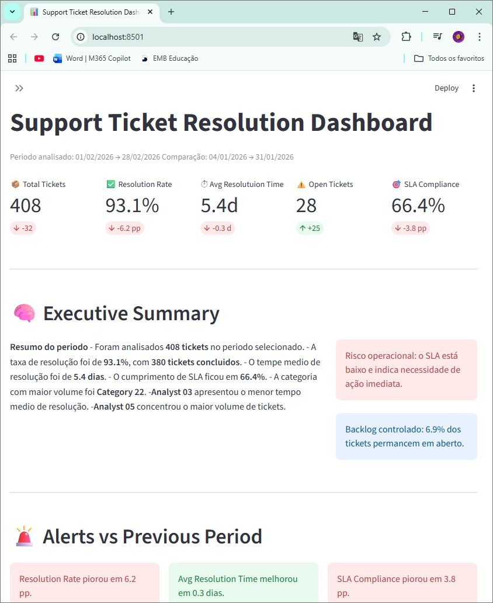

# Seller Issue Resolution Dashboard

Dashboard interativo desenvolvido em **Python + Streamlit** para monitorar a resolução de issues de sellers, com foco em **eficiência operacional**, **SLA**, **performance do time** e **identificação de gargalos**.

O projeto foi construído com a proposta de transformar dados operacionais em uma visão executiva e analítica, permitindo acompanhar indicadores-chave de atendimento e apoiar a tomada de decisão.

---

## Objetivo do projeto

Este dashboard foi desenvolvido para responder perguntas como:

- Quantos tickets foram tratados no período?
- Qual a taxa de resolução do time?
- Quanto tempo, em média, leva para resolver um issue?
- Quantos tickets ainda estão em aberto?
- Quais categorias concentram mais problemas?
- Como está a performance dos analistas?
- Os tickets estão sendo resolvidos dentro do SLA esperado?

A ideia central do projeto é mostrar como dados podem ser usados para **diagnosticar problemas operacionais**, **acompanhar produtividade** e **gerar insights acionáveis**.

---

## Preview

